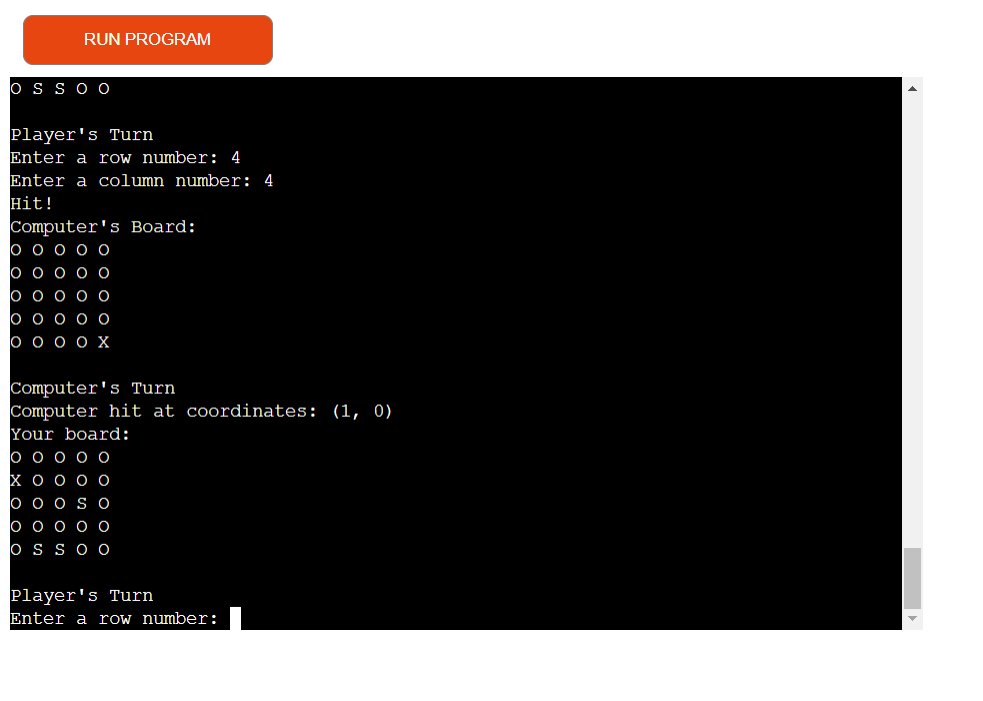
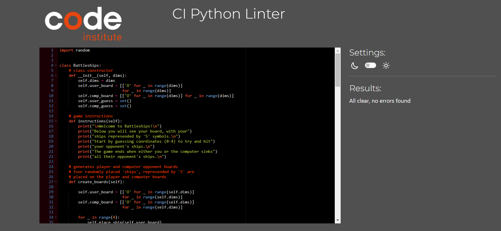

# Battleships Game
## Contents:
1. Description
2. Design Features
3. Testing
4. Deployment
5. Credits

--------------

[Site Link](https://battleshipshg-03b28f4389d2.herokuapp.com/)

## Description:

Battleships is a python programme designed to simulate a version of the popular boardgame of the same name. It works by setting out game boards for the player and the computer, with both boards being populated by 4 'ships' each, represented by 'S' symbols on the board. 

The positions of the ships are randomly generated at the start of each game to ensure variation and replayability. The player is then prompted to choose both a column and row number to produce a coordinate. If the guessed coordinate corresponds with a computer ship, it will be crossed out and its position displayed to the player. 

The computer also takes turns selecting points on the player's board at random to try and guess the location of the player's ships. The game ends when either the player or the computer loses all of their ships. An option is given to the player to play again or not. 

### Project Goals and Outcomes:

The goal of this project is to provide users with a challenging, replayable game app. The screenshots in the design featues section demonstrate this has been achieved by allowing users to conntrol their input, and adjust their actions based on new information. The board randomisation allows players to replay the game with a different layout, whilst the computer opponent's actions create an element of challenge. The code also provides scope for potential additional features to expand the existing game.

--------------

## Design features: 

The game instructions/introduction are displayed at the start. The game displays the game boards as seen below. The size of the boards can also be customised on the back-end using the 'dims' feature.

As coordinates are entered, the game checks whether these are valid numeric values, as well as if numeric values fall within the limits of the board. The game also checks for repeat guesses.

    

As the game progresses, hit ships are highlighted. The player can only see computer ships that have already been hit.

Once the game has finished, players have the choice to play again with a new randomly generated board, or to quit the game.

  

### Data Model:

This app uses an overall 'Battleships' class as it's data model, which encapsulates the game logic and data. The key components of the model are: 

- Game Boards - the game boards for both the player and computer component are represented as 2D lists, with each cell in the board being either an empty space, a ship(S) or a hit(X).
  
- Guessed Coordinates - the player and computer guesses are stored in sets to ensure uniqueness, and allow guessed coordinates to be tracked.
  
- Operational Functions - the functions within the data model, including those that create and print the boards, validate coordinate guesses, and the main game function.

- Board Dimensions('dims') - this parameter represents the dimensions of the board, allowing the game to potentially be adapted to create larger boards.

### Potential future features to include:
- Allow players to adjust board size at will
- Allow manual ship placement and customisation
- Introduce different symbols for different ships e.g. a submarine, or a cruiser
- Allow increased difficulty by weighting the likelihood the computer opponent will hit a player ship

--------------
## Testing:

The app was tested with an early deployment to Heroku in advance of the final version deployment, to confirm no errors occur. It was also tested prior to deployment using Visual Studio Code's run python code function.

**Bugs:**

Fixed bugs:

While testing, it was found that the boards generated when a user plays another round of the game were still populated by the 'hit' ships from the previous round.

This was resolved by creating a separate function for generating the computer's ships, and making sure the boards are reset to their initial states when a new game is launched - upon which they are then populated.

**Validation:**

The app was tested using the Code Institute Python Linter, and produced no errors, as can be seen below:

CI Python Linter

--------------
## Deployment:

This app was deployed with Heroku and linked to a GitHub repository, using the steps below:
- Clone or fork the relevant repository
- Create a new app in Heroku
- Link the app to the relevant GitHub repository
- Create a config var named PORT set to a value of 8000
- Add the NodeJS and Python buildpacks
- Deploy the app, making sure the correct repository branch is selected, in this case 'main'

--------------
## Credits:

- Code Institute - deployment terminal and heroku credits

